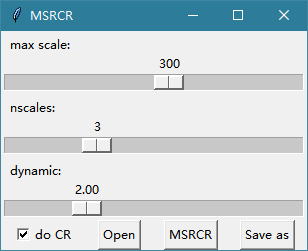
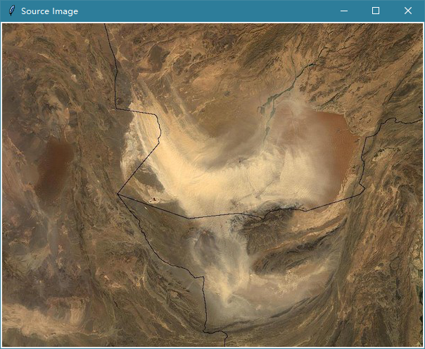
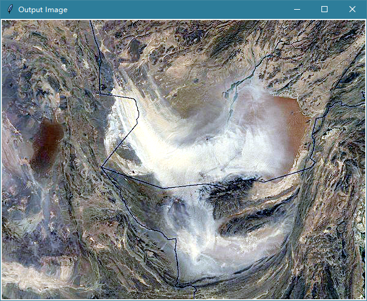

# MSRCR Python

MSRCR(Multi-Scale Retinex with Color Restoration) 带色彩恢复的多尺度视网膜增强算法。

可以参看这篇[博客](https://www.cnblogs.com/Imageshop/archive/2013/04/17/3026881.html)。该作者按照GIMP中的contrast-retinex插件源码制作了一个MSRCR小工具，并提供了可执行程序(.exe)[下载](http://files.cnblogs.com/Imageshop/Retinex.zip)。作者提供了GIMP的插件的[源码下载](http://files.cnblogs.com/Imageshop/contrast-retinex.rar)，但没有提供自制工具的源码下载，而这个工具用起来限制颇多也不能用命令行。

前一段时间用到MSRCR算法，于是照着源码自己用Python实现了一个类似的工具，效果基本上相同(当然速度慢很多)。包含命令模式(MSRCR.py)和GUI小工具(MSRCR_GUI.py)两个文件。

## 命令行

运行`MSRCR.py`文件即可。

```shell
usage: python MSRCR.py [-h] -i INPUT -o OUTPUT [-s S] [-n N] [-d D]

optional arguments:
  -h, --help                       show this help message and exit
  -i INPUT, --input INPUT          Input image path
  -o OUTPUT, --output OUTPUT       Output image path
  -s S                             The scale (reference value)
  -n N                             The number of scale
  -d D                             The dynamic, the smaller the value, the higher the contrast
```

## GUI小工具

运行`MSRCR_GUI.py`文件即可。








